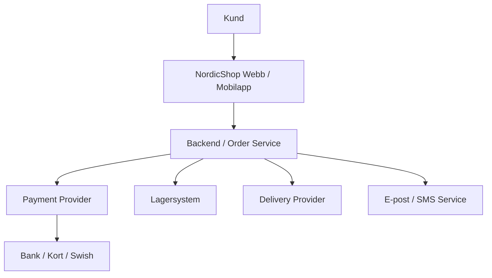

# Integrationer

## Systemlandskap

## Komponenter och ägarskap
| System / Komponent | Ägare |
|---|---|
| Webbplats | Nordicshop |
| Mobilapp | Nordicshop |
| Backend | Nordicshop | 
| Order service | Nordicshop |
| Lagersystem | Nordicshop |
| Betalningstjänst | Extern |
| SMS/E-post tjänst | Extern |
| Leveranstjänst | Extern |

## Integration - Vart och hur kan fel uppstå?

| Från | Till | Information | Risk |
|---|---|---|---|
| Mobilapp | Backend(Server) | Appen anropar backend som sköter logik | API anrop mellan komponenter misslyckas |
| Webbplats | Backend(DB) | Webbplats anropar lager som måste uppdateras | Webbplats skickar ogiltig data, databas uppdateras fel |
| Backend | Betaltjänst | Backend anropar betaltjänst vid transaktion | Betaltjänst är nere eller kan ej anropas, blir en SPOF |
| Betaltjänst | Swish | Betaltjänst anropar swish som betalningsmetod | Swish är nere, skapar beroende vi ej kan påverka |
| Backend | Leveranstjänst | Backend anropar leverans för transport | Leveranstjänst mottar fel information, varor stannar |
